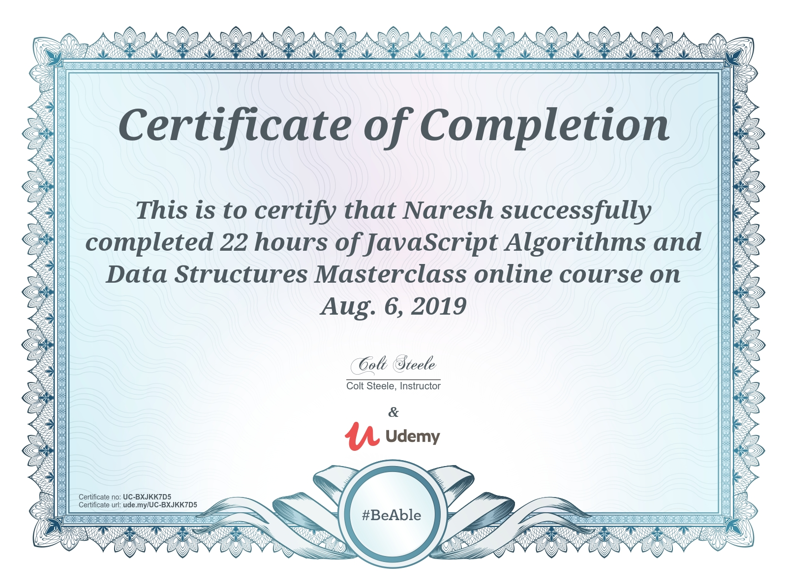

### `Data-Structures and Algorithms`

# Array sorting techniques

<table style="width:100%">
  <tr>
    <th>Sort</th>
    <th>Time Complexity</th>
  </tr>
  <tr>
    <td>Bubble Sort</td>
    <td>O(n^2)</td> 
  </tr>
  <tr>
    <td>Selection Sort</td>
    <td>O(n^2)</td> 
  </tr>
  <tr>
    <td>Merge Sort</td>
    <td>O(nlogn)</td> 
  </tr>
  <tr>
    <td>Radix Sort</td>
    <td>O(kn)</td> 
  </tr>
</table>

# Data Structures

<table style="width:100%">
  <tr>
    <th>Data Structure</th>
    <th>Access</th>
     <th>Search</th>
    <th>Insertion</th>
    <th>Deletion</th>
  </tr>
  <tr>
    <td>Singly Linked List</td>
    <td>O(n)</td>
    <td>O(n)</td> 
    <td>O(1)</td> 
    <td>O(n)</td>
  </tr>
   <tr>
    <td>Doubly Linked List</td>
    <td>O(n)</td>
    <td>O(n)</td> 
    <td>O(1)</td> 
    <td>O(n)</td>
  </tr>
   <tr>
    <td>Queues</td>
    <td>O(n)</td>
    <td>O(n)</td> 
    <td>O(1)</td> 
    <td>O(1)</td>
  </tr>
   <tr>
    <td>Stacks</td>
    <td>O(n)</td>
    <td>O(n)</td> 
    <td>O(1)</td> 
    <td>O(1)</td>
  </tr>
   <tr>
    <td>Heaps</td>
    <td>O(n)</td>
    <td>O(n)</td> 
    <td>O(1)</td> 
    <td>O(n)</td>
  </tr>
  <tr>
    <td>Priority Queue</td>
    <td>O(n)</td>
    <td>O(n)</td> 
    <td>O(1)</td> 
    <td>O(n)</td>
  </tr>
  <tr>
    <td>Hash Tables</td>
    <td>O(n)</td>
    <td>O(n)</td> 
    <td>O(1)</td> 
    <td>O(n)</td>
  </tr>
  <tr>
    <td>Graphs</td>
    <td>O(n)</td>
    <td>O(n)</td> 
    <td>O(1)</td> 
    <td>O(n)</td>
  </tr>
</table>

# Algorithms

<ul>
<li>
Dijkstra's shortest path
</li>
<li>
Ulam Spiral
</li>
</ul>
 

